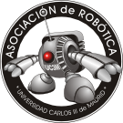

# Tutoriales

Recopilación de tutoriales y materiales útiles sobre los programas y herramientas que usamos en [ASROB](https://asrob.uc3m.es).

Pincha en la opción que quieras, o utiliza las teclas P y N para avanzar secuencialmente (P: anterior, N: siguiente).

## Notas adicionales

El contenido de esta documentación se genera a partir de ficheros alojados en: <https://github.com/asrob-uc3m/tutoriales>.

## Si tienes dudas con respecto al contenido

Por favor comenta de forma pública [AQUÍ](https://github.com/asrob-uc3m/tutoriales/issues/new).
