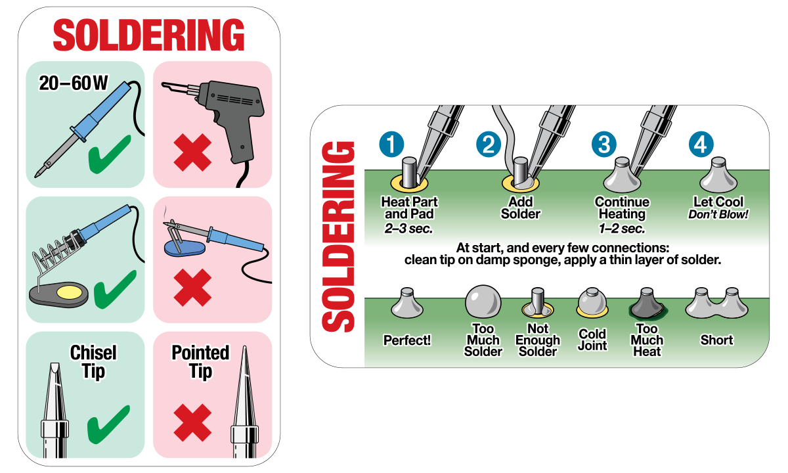

# Estación de soldadura Baku 601D

## Uso de la pistola de aire caliente
- No utilizar velocidades de aire superiores al número 4, menos aun con boquillas estrechas. El motor se calienta.
- La estación tiene un sistema de standby: al colocar la pistola en la base (con la boquilla por detrás, el cable por delante), se apaga la resistencia calentadora y el ventilador acelera, para enfriarse. Tiene un imán o algo parecido para detectar cuando la pistola está en la base. Cuando detecta que está en la base, procede con el enfriado, y lo indica en la pantalla. El ventilador se apaga automáticamente cuando la resistencia está fría.
- Antes de apagar la pistola, asegurarse de que la resistencia está fría.

## Instrucciones para el soldador
- No dejar encendido si no se está usando.
- La punta del soldador se oxida y pierde sus propiedades con la temperatura excesiva.
- Ajustar una temperatura entre 300 y 320ºC aproximadamente, es la temperatura adecuada para la mayoría de trabajos.
- Para casos puntuales se pueden usar temperaturas más altas, pero no suelen ser necesarias.
- La punta del soldador tiene que estar siempre mojada en estaño, esto la protege de la oxidación.
- Para que la punta siempre esté mojada conviene limpiar la punta con el "estropajo" antes de soldar, no después.
- La punta del soldador se limpia con el estropajo metálico que ASROB provee. Esta asociación no tolera esponjas mojadas, ni aunque sea con agua destilada.
- Las puntas cónicas las quemamos y con sus lágrimas forjamos puntas biseladas o planas.

